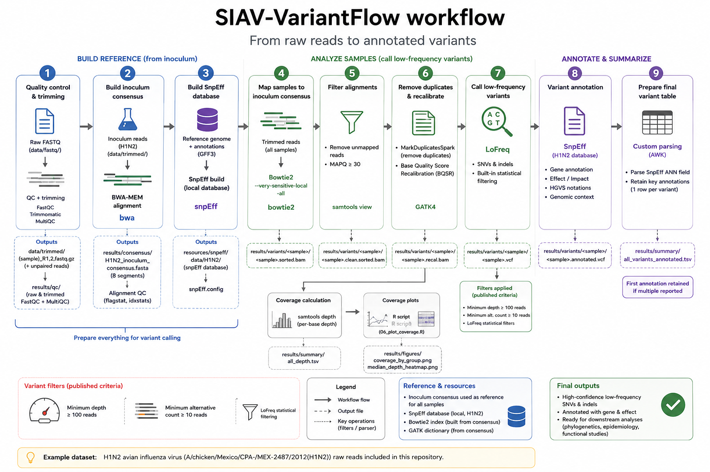

# SIAV-VariantFlow

### A reproducible workflow for low-frequency intrahost variant analysis of swine influenza A virus

**SIAV-VariantFlow** is a reproducible bioinformatics workflow for the detection, annotation and visualization of low-frequency intrahost genetic variation in swine influenza A virus (swIAV) from Illumina paired-end sequencing data.

The workflow covers the analysis from raw sequencing reads to annotated variant tables and coverage visualizations.

> **Example dataset:** The sequencing data used in this repository correspond specifically to the **H1N2 study** associated with **NCBI BioProject PRJNA994299**.

---

## Background

SIAV-VariantFlow grew out of the bioinformatics workflows I progressively developed during my doctoral research at **IRTA-CReSA and the Universitat Autònoma de Barcelona (UAB)** to investigate the within-host evolution of swine influenza A virus.

These analyses evolved across studies involving H1N1, H3N2 and H1N2 viruses under different immune scenarios, including vaccination, previous infection and coinfection. SIAV-VariantFlow consolidates and updates these analyses into a documented and reproducible workflow that can be adapted to other influenza A virus sequencing datasets.

---

## Workflow overview



The workflow first reconstructs an inoculum consensus genome from the H1N2 inoculum sample and uses this consensus as the reference for low-frequency variant analysis in the remaining samples.

A local H1N2 SnpEff database is built from the reference FASTA and GFF3 files for functional annotation of retained variants.

---

## Quick start

Create the main Conda environment:

```bash
conda env create -f environment.yml
conda activate siav-variantflow
```

SnpEff is maintained in a separate environment because it requires a newer Java runtime:

```bash
conda env create -f environment_snpeff.yml
```

The complete H1N2 example can then be reproduced sequentially:

```bash
conda activate siav-variantflow

bash scripts/00_download_data.sh
bash scripts/01_quality_control.sh
bash scripts/02_build_inoculum_consensus.sh

conda activate siav-snpeff
bash scripts/03_build_snpeff_database.sh

conda activate siav-variantflow
bash scripts/04_analyze_samples.sh --all
bash scripts/05_prepare_variant_table.sh

Rscript scripts/06_plot_coverage.R
```

Sample identifiers and SRA accessions are provided in `metadata/samples.tsv`, while experimental groups used for visualization are defined in `metadata/experimental_groups.tsv`.

The R visualization step requires **ggplot2**, **dplyr** and **ggpubr**.

---

## Variant analysis

The core workflow maps sequencing reads against the reconstructed **H1N2 inoculum consensus**, calculates genome-wide sequencing depth, performs base-quality recalibration, calls low-frequency variants with **LoFreq**, applies the filtering criteria used in the associated study and annotates retained variants using a custom **SnpEff** database.

Default SNV criteria:

```text
Minimum sequencing depth:        100 reads
Minimum alternative read count:  10 reads
```

LoFreq additionally performs statistical variant-quality filtering.

These thresholds reflect the criteria implemented for the associated analysis and should be independently evaluated when applying the workflow to other sequencing protocols or biological questions.

---

## Main outputs

The workflow generates three main analysis-ready outputs:

```text
results/summary/all_depth.tsv
results/summary/all_variants.tsv
results/summary/all_variants_annotated.tsv
```

### Genome coverage by experimental group


### Median sequencing depth


---

## Adapting SIAV-VariantFlow

Although the example included here reproduces the **H1N2 study**, the workflow originated from analyses developed across several swine influenza A virus experiments.

For other influenza A virus datasets, users should adapt the sample metadata, reference genome and annotation, SnpEff database, experimental groups and, where scientifically justified, variant-filtering thresholds.

Particular attention should be paid to reference and annotation consistency because of the segmented influenza A genome and overlapping gene products.

---

## Associated publications

SIAV-VariantFlow was developed and refined from bioinformatics analyses used across the following swine influenza A virus studies:

**López-Valiñas Á, et al. (2021).**  
*Identification and Characterization of Swine Influenza Virus H1N1 Variants Generated in Vaccinated and Nonvaccinated, Challenged Pigs.*  
Viruses 13:2087.  
DOI: 10.3390/v13102087

**López-Valiñas Á, et al. (2022).**  
*Evolution of Swine Influenza Virus H3N2 in Vaccinated and Nonvaccinated Pigs after Previous Natural H1N1 Infection.*  
Viruses 14:2008.  
DOI: 10.3390/v14092008

**López-Valiñas Á, et al. (2023).**  
*Vaccination against swine influenza in pigs causes different drift evolutionary patterns upon swine influenza virus experimental infection and reduces the likelihood of genomic reassortments.*  
Frontiers in Cellular and Infection Microbiology 13:1111143.  
DOI: 10.3389/fcimb.2023.1111143

**López-Valiñas Á, et al. (2023).**  
*Genetic diversification patterns in swine influenza A virus (H1N2) in vaccinated and nonvaccinated animals.*  
Frontiers in Cellular and Infection Microbiology 13:1258321.  
DOI: 10.3389/fcimb.2023.1258321

> **The sequencing dataset provided as the reproducible example in this repository corresponds to the H1N2 study above (BioProject PRJNA994299).**

---

## Citation

If you use SIAV-VariantFlow, please cite this repository and the publication most relevant to the analysis being reproduced.

For analyses based on the H1N2 example dataset, please also cite:

> López-Valiñas Á, Valle M, Pérez M, Darji A, Chiapponi C, Ganges L, Segalés J, Núñez JI. Genetic diversification patterns in swine influenza A virus (H1N2) in vaccinated and nonvaccinated animals. Frontiers in Cellular and Infection Microbiology. 2023;13:1258321. doi:10.3389/fcimb.2023.1258321.

A machine-readable citation for SIAV-VariantFlow is provided in `CITATION.cff`.

---

## Author

**Álvaro López-Valiñas, PhD**  
Bioinformatics · Viral genomics · Infectious diseases  
ORCID: 0000-0002-7492-5108

---

## PhD thesis

SIAV-VariantFlow originates from the bioinformatics analyses developed during my doctoral research on swine influenza A virus evolution.

**López-Valiñas, Álvaro. _Evolution of swine influenza virus associated with vaccination._**

The complete PhD thesis is available through the Universitat Autònoma de Barcelona institutional repository:

https://ddd.uab.cat/pub/tesis/2023/hdl_10803_688403/alv1de1.pdf
