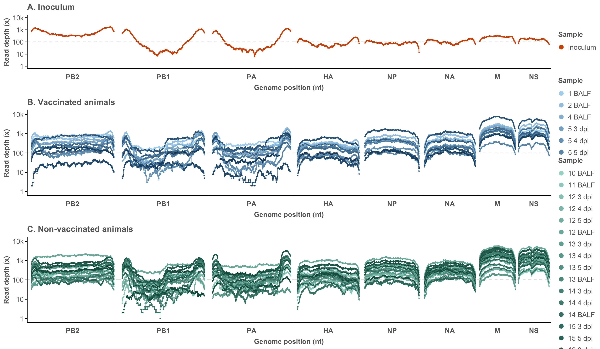
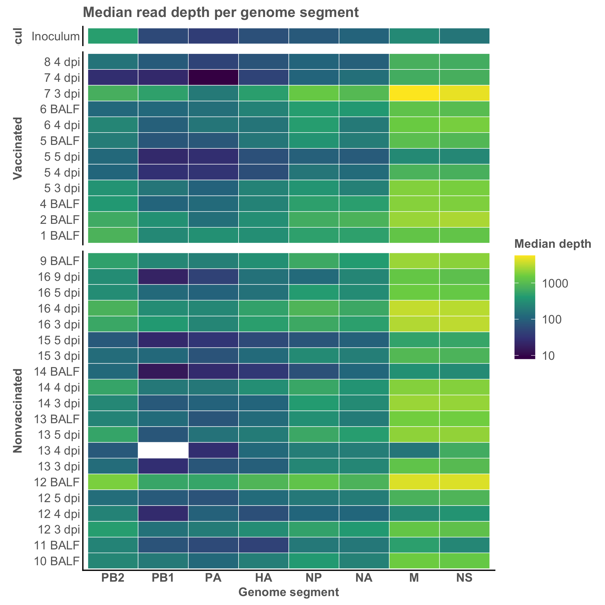

# SIAV-VariantFlow

### A reproducible workflow for low-frequency intrahost variant analysis of swine influenza A virus

**SIAV-VariantFlow** is a reproducible bioinformatics workflow for the detection, annotation and visualization of low-frequency intrahost genetic variation in swine influenza A virus (swIAV) from Illumina paired-end sequencing data.

The workflow covers the complete analysis from raw sequencing reads to annotated variant tables and coverage visualizations. The H1N2 dataset associated with **NCBI BioProject PRJNA994299** is provided as a reproducible example.

---

## Background

SIAV-VariantFlow grew out of the bioinformatics workflows I progressively developed during my doctoral research at **IRTA-CReSA and the Universitat Autònoma de Barcelona (UAB)** to investigate the within-host evolution of swine influenza A virus.

Influenza A virus has a remarkable capacity for genetic diversification through mutation and genome reassortment. During my PhD, I used next-generation sequencing to investigate how viral populations evolve under different immune scenarios, including vaccination, previous infection and coinfection. These studies required the detection and interpretation of low-frequency genetic variants arising within individual hosts.

The workflow evolved alongside these projects and was refined across studies involving H1N1, H3N2 and H1N2 swine influenza viruses. **SIAV-VariantFlow consolidates, reorganizes and updates these analyses into a documented and reproducible workflow that can be adapted to future influenza A virus sequencing studies.**

---

## Workflow overview

```text
NCBI SRA / Illumina paired-end reads
                 │
                 ▼
        00_download_data.sh
                 │
                 ▼
           Raw FASTQ files
                 │
                 ▼
       01_quality_control.sh
                 │
       FastQC / Trimmomatic
             / MultiQC
                 │
                 ▼
        Trimmed paired reads
                 │
                 ├──────────────────────────┐
                 ▼                          │
02_build_inoculum_consensus.sh              │
                 │                          │
                 ▼                          │
     Inoculum consensus genome              │
                 │                          │
                 ▼                          │
       04_analyze_samples.sh ◄──────────────┘
                 │
        Mapping / BAM processing
          Coverage calculation
             BQSR / LoFreq
          Variant filtering
          SnpEff annotation
                 │
           ┌─────┴─────┐
           ▼           ▼
   all_variants.tsv  all_depth.tsv
           │           │
           ▼           ▼
05_prepare_variant  06_plot_coverage.R
     _table.sh
           │           │
           ▼           ▼
 Annotated variants  Coverage figures
```

The custom SnpEff database required for variant annotation is generated with:

```text
03_build_snpeff_database.sh
```

---

## Pipeline stages

### 00 — Download sequencing data

```bash
bash scripts/00_download_data.sh
```

Downloads the H1N2 sequencing dataset from NCBI using the SRA Toolkit.

Sample identifiers and SRA accessions are defined in:

```text
metadata/samples.tsv
```

Output:

```text
data/fastq/<sample>_R1.fastq.gz
data/fastq/<sample>_R2.fastq.gz
```

---

### 01 — Quality control and read trimming

```bash
bash scripts/01_quality_control.sh
```

Performs quality assessment and trimming of paired-end Illumina reads using **FastQC, Trimmomatic and MultiQC**.

Main outputs:

```text
data/trimmed/<sample>_R1.fastq.gz
data/trimmed/<sample>_R2.fastq.gz
results/qc/
```

---

### 02 — Build the inoculum consensus genome

```bash
bash scripts/02_build_inoculum_consensus.sh
```

The inoculum reads are mapped against the initial H1N2 reference to reconstruct the consensus sequence of the viral population used for experimental infection.

Output:

```text
results/consensus/H1N2_inoculum_consensus.fasta
```

This consensus is subsequently used as the reference for sample-level intrahost variant analysis.

---

### 03 — Build the custom SnpEff database

SnpEff is maintained in a separate Conda environment because the current release requires a newer Java runtime than the GATK environment used by the main workflow.

```bash
conda activate siav-snpeff
bash scripts/03_build_snpeff_database.sh
```

The database is generated from:

```text
reference/H1N2_reference.fasta
reference/H1N2_reference.gff3
```

and stored locally under:

```text
resources/snpeff/data/H1N2/
```

Afterwards, return to the main environment:

```bash
conda activate siav-variantflow
```

---

### 04 — Mapping, coverage and low-frequency variant analysis

This is the core analysis stage.

To analyse a single sample:

```bash
bash scripts/04_analyze_samples.sh 01_BALF
```

To analyse all samples:

```bash
bash scripts/04_analyze_samples.sh --all
```

The number of threads can be adjusted if required:

```bash
THREADS=8 bash scripts/04_analyze_samples.sh --all
```

For each sample, the workflow performs mapping and BAM processing, calculates genome-wide sequencing depth, performs base-quality recalibration, calls low-frequency variants with **LoFreq**, applies the variant criteria used in the published analyses, and annotates retained variants with **SnpEff**.

The default SNV criteria are:

```text
Minimum sequencing depth:        100 reads
Minimum alternative read count:  10 reads
```

LoFreq additionally performs its own statistical variant-quality filtering.

Thresholds can be changed when required:

```bash
MIN_DEPTH=100 MIN_ALT_COUNT=10 bash scripts/04_analyze_samples.sh --all
```

Individual sample results are stored under:

```text
results/variants/<sample>/
```

The workflow also produces combined tables containing variants and sequencing depth across all samples.

---

### 05 — Prepare the final variant table

```bash
bash scripts/05_prepare_variant_table.sh
```

This stage parses the SnpEff `ANN` field from:

```text
results/summary/all_variants.tsv
```

and retains the annotation fields required for downstream interpretation.

Output:

```text
results/summary/all_variants_annotated.tsv
```

This reproduces the annotation parsing performed in the historical workflow while making the procedure explicit and reproducible.

---

### 06 — Coverage visualization

```bash
Rscript scripts/06_plot_coverage.R
```

Coverage information from:

```text
results/summary/all_depth.tsv
```

is combined with the experimental design defined in:

```text
metadata/experimental_groups.tsv
```

to generate:

```text
results/figures/coverage_by_group.png
results/figures/median_depth_heatmap.png
```

The grouped coverage visualization preserves the experimental structure of the study.

---

## Example outputs

### Genome coverage by experimental group



### Median sequencing depth



---

## Installation

Clone the repository and create the main Conda environment:

```bash
conda env create -f environment.yml
conda activate siav-variantflow
```

The environment includes the main tools required by the workflow:

- FastQC
- MultiQC
- Trimmomatic
- BWA
- Bowtie2
- SAMtools
- BCFtools
- GATK
- LoFreq
- gffread
- SRA Toolkit
- Python
- OpenJDK 17

SnpEff uses a separate environment:

```bash
conda env create -f environment_snpeff.yml
conda activate siav-snpeff
```

This environment uses **SnpEff 5.4c** with **OpenJDK 21**.

### R requirements

Coverage visualization requires R with:

```r
ggplot2
dplyr
ggpubr
```

If required:

```r
install.packages(c("ggplot2", "dplyr", "ggpubr"))
```

---

## Running the complete workflow

The H1N2 example can be reproduced sequentially:

```bash
conda activate siav-variantflow

bash scripts/00_download_data.sh
bash scripts/01_quality_control.sh
bash scripts/02_build_inoculum_consensus.sh

conda activate siav-snpeff
bash scripts/03_build_snpeff_database.sh

conda activate siav-variantflow
bash scripts/04_analyze_samples.sh --all
bash scripts/05_prepare_variant_table.sh

Rscript scripts/06_plot_coverage.R
```

---

## Repository structure

```text
SIAV-VariantFlow/
│
├── README.md
├── CITATION.cff
├── environment.yml
├── environment_snpeff.yml
│
├── scripts/
│   ├── 00_download_data.sh
│   ├── 01_quality_control.sh
│   ├── 02_build_inoculum_consensus.sh
│   ├── 03_build_snpeff_database.sh
│   ├── 04_analyze_samples.sh
│   ├── 05_prepare_variant_table.sh
│   └── 06_plot_coverage.R
│
├── metadata/
│   ├── samples.tsv
│   └── experimental_groups.tsv
│
├── reference/
│   ├── H1N2_reference.fasta
│   ├── H1N2_reference.gff3
│   └── H1N2_snpeff.gff3
│
├── resources/
│   └── snpeff/
│       └── snpEff.config
│
└── results/
    ├── summary/
    │   ├── all_depth.tsv
    │   ├── all_variants.tsv
    │   └── all_variants_annotated.tsv
    │
    └── figures/
        ├── coverage_by_group.png
        └── median_depth_heatmap.png
```

Large sequencing files, BAM files, intermediate VCFs, QC outputs and generated reference indices are intentionally excluded from version control.

---

## Adapting SIAV-VariantFlow to other influenza datasets

The H1N2 study serves as the reproducible example included in this repository, but the workflow was developed across several swine influenza A virus studies involving different viral subtypes and experimental designs.

For a new influenza A virus dataset, the main elements to adapt are:

- sample metadata and FASTQ identifiers;
- reference genome and annotation;
- SnpEff database;
- experimental-group metadata;
- analysis thresholds, when scientifically justified.

Particular attention should be paid to reference and annotation consistency because of the segmented influenza A genome and the presence of overlapping gene products.

Variant-calling thresholds should always be validated for the sequencing protocol, dataset and biological question being investigated.

---

## Associated publications

The workflow was developed and refined across the following swine influenza A virus studies:

**López-Valiñas Á, et al. (2021).**  
*Identification and Characterization of Swine Influenza Virus H1N1 Variants Generated in Vaccinated and Nonvaccinated, Challenged Pigs.*  
Viruses 13:2087.  
DOI: 10.3390/v13102087

**López-Valiñas Á, et al. (2022).**  
*Evolution of Swine Influenza Virus H3N2 in Vaccinated and Nonvaccinated Pigs after Previous Natural H1N1 Infection.*  
Viruses 14:2008.  
DOI: 10.3390/v14092008

**López-Valiñas Á, et al. (2023).**  
*Vaccination against swine influenza in pigs causes different drift evolutionary patterns upon swine influenza virus experimental infection and reduces the likelihood of genomic reassortments.*  
Frontiers in Cellular and Infection Microbiology 13:1111143.  
DOI: 10.3389/fcimb.2023.1111143

**López-Valiñas Á, et al. (2023).**  
*Genetic diversification patterns in swine influenza A virus (H1N2) in vaccinated and nonvaccinated animals.*  
Frontiers in Cellular and Infection Microbiology 13:1258321.  
DOI: 10.3389/fcimb.2023.1258321

The H1N2 study corresponds to the sequencing dataset reproduced in the current version of SIAV-VariantFlow.

---

## Citation

If you use SIAV-VariantFlow, please cite this repository and the publication most relevant to the analysis being reproduced.

For analyses based on the H1N2 example dataset and workflow, please also cite:

> López-Valiñas Á, Valle M, Pérez M, Darji A, Chiapponi C, Ganges L, Segalés J, Núñez JI. Genetic diversification patterns in swine influenza A virus (H1N2) in vaccinated and nonvaccinated animals. Frontiers in Cellular and Infection Microbiology. 2023;13:1258321. doi:10.3389/fcimb.2023.1258321.

A machine-readable citation for SIAV-VariantFlow is provided in `CITATION.cff`.

---

## Author

**Álvaro López-Valiñas, PhD**  
Bioinformatics · Viral genomics · Infectious diseases  
ORCID: 0000-0002-7492-5108

---

## Disclaimer

SIAV-VariantFlow is intended for research use. Variant-calling thresholds should be validated for each sequencing protocol, dataset and biological question.
